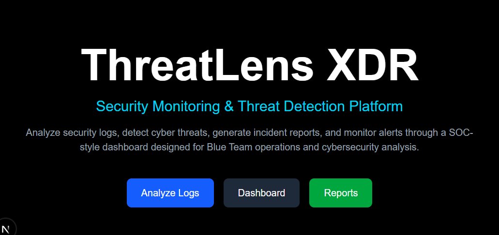
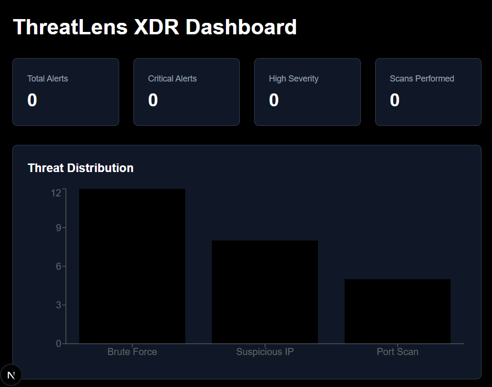

# 🛡️ ThreatLens XDR

### AI-Powered Security Monitoring & Threat Detection Platform

ThreatLens XDR is a cybersecurity-focused security monitoring platform designed to analyze logs, detect malicious activities, visualize threats, and generate incident reports through an interactive SOC-style dashboard.

---

## 🚀 Features

### Threat Detection Engine

* Brute Force Attack Detection
* Suspicious IP Detection
* Port Scan Detection
* Severity Classification

### Security Operations Dashboard

* Real-Time Threat Overview
* Threat History Tracking
* Threat Distribution Pie Chart
* Dashboard Metrics

### Incident Management

* PDF Incident Report Generation
* CSV Threat History Export
* Alert Persistence using Local Storage
* Threat History Cleanup

### User Experience

* Modern Dark-Themed Interface
* Responsive Design
* Interactive Dashboard
* Easy Log Upload & Analysis

---

## 🖼️ Screenshots

### Homepage



### Dashboard



---

## 🏗️ Architecture

```text
User Uploads Log File
          │
          ▼
     Threat Analyzer
          │
 ┌────────┼────────┐
 ▼        ▼        ▼
Brute   Susp. IP  Port
Force   Detector  Scanner
          │
          ▼
     Risk Evaluation
          │
          ▼
    Threat History
          │
 ┌────────┼────────┐
 ▼        ▼        ▼
Dashboard PDF     CSV
          │
          ▼
      SOC View
```

---

## 🛠️ Tech Stack

* Next.js
* TypeScript
* Tailwind CSS
* Recharts
* jsPDF
* LocalStorage

---

## 📦 Installation

```bash
git clone https://github.com/YakkatiKarthikSai/threatlens-xdr.git

cd threatlens-xdr

npm install

npm run dev
```

---

## 📊 Current Capabilities

* Upload Security Logs
* Detect Brute Force Attempts
* Detect Suspicious IP Activity
* Detect Port Scanning Activity
* Store Threat History
* Generate Incident Reports
* Export Threat Data
* Visualize Threat Statistics

---

## 🔮 Future Enhancements

* User Authentication
* Database Integration
* Live Threat Monitoring
* Email Alerting
* Threat Intelligence Integration
* SIEM Integration
* Advanced Analytics

---

## 👨‍💻 Author

**Karthik Sai Yakkati**

Cybersecurity Student | Blue Team Enthusiast | Security Research Learner

GitHub: https://github.com/YakkatiKarthikSai
